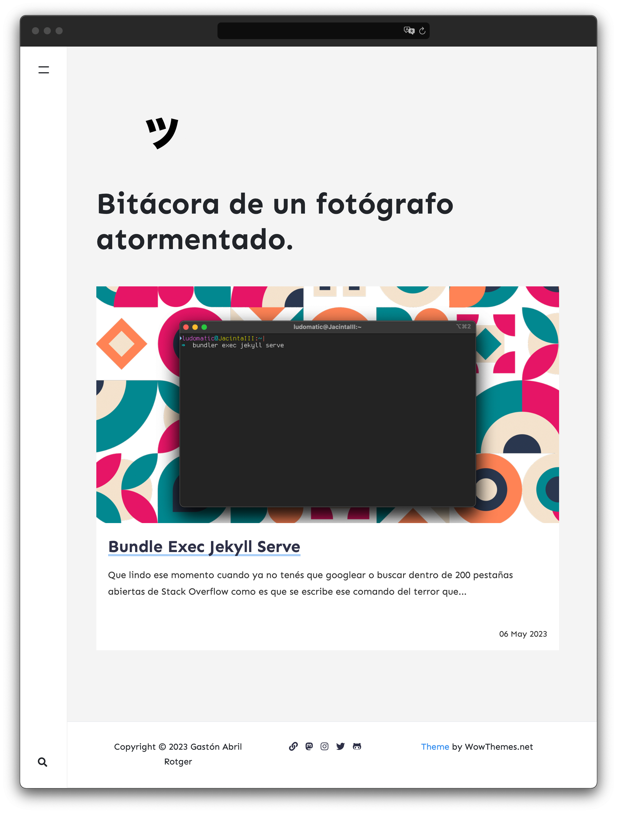

# Bitacora de un fotógrado atormentado. My personal blog.

This blog is using [Memoirs Jekyll Theme](https://wowthemes.net/memoirs-free-jekyll-theme/). See [here](https://wowthemesnet.github.io/jekyll-theme-memoirs/) for details of the original version of this theme. I update this README.md using [Type Theme](https://github.com/ahmadajmi/type) README.md as a template. Amazing Jekyll theme. Definitely you should check it.

## Table of Content

- [Bitacora de un fotógrado atormentado. My personal blog.](#bitacora-de-un-fotógrado-atormentado-my-personal-blog)
  - [Table of Content](#table-of-content)
  - [Configurations](#configurations)
  - [Deployment](#deployment)
  - [Posts](#posts)
  - [Rating](#rating)
  - [Adsense](#adsense)
  - [Table of Content.](#table-of-content-1)
  - [Gitcus](#gitcus)
  - [Favicon](#favicon)
  - [Last updates](#last-updates)


## Configurations

Type theme comes with different customizations in the `_config.yml` file. I added it a few more.

```sh
# Site
name: ""
title: ""
description: ""
logo: ''
logo_hover: ''
favicon: ''
baseurl: ""
google_analytics: ''
include: ["_pages"]
permalink: /:title/
email: 

# Gitcus - Check https://giscus.app to get your Repo-IDs 
# Copy the "Enable giscus" section from giscus.app into gitcus.html file
# "enabled" or "disabled"
gitcus: "enabled"

#Footer
socials:
  personal_web: 
  mastodon: 
  twitter: 
  instagram: 
  github:

# Plugins
plugins:
  - jekyll-paginate
  - jekyll-sitemap
  - jekyll-feed
  - jekyll-seo-tag
  - jekyll-archives
  - jekyll-figure
  - jemoji  
    
# Archives
jekyll-archives:
  enabled:
    - categories
  layout: archive
  permalinks:
    category: '/category/:name/'
    
# Pagination 
paginate: 6
paginate_path: /page:num/
    
# Other
highlighter: none
markdown: kramdown
kramdown:
   syntax_highlighter_opts:
      disable : true


# Adsense (change to "enabled" to activate, also your client id and ad slot. Create a new ad unit from your Adsense account to get the slot.)
adsense: "disabled"
adsense-data-ad-client: ""
adsense-data-ad-slot: ""

# Lazy Images ("enabled" or "disabled")
lazyimages: "disabled"

# Sass
sass:
  sass_dir: _sass
  style: compressed

exclude: [changelog.md, LICENSE.txt, README.md, Gemfile, Gemfile.lock]

# RSS

feed_items: 10
feed_update_period: daily
feed_update_frequency: 1
```

## Deployment

To run the theme locally, navigate to the theme directory and run `bundle install` to install the dependencies, then run `bundle exec jekyll serve -o` to start the Jekyll server. If you use `--host IP port:XXXX` you can run it in a specific ip address for test it in any divice. 
`bundle exec jekyll serve --host IP-WHERE-YOU-ARE-TESTING port:4000 -o`

## Posts

```
---
layout: post
title:  "We all wait for summer"
categories: [ Lifestyle, Travel ]
tags: [ France ]
image: assets/images/5.jpg
description: "Something about this post here"
comments: false
---
```
## Rating

```
---
layout: post
title:  "We all wait for summer"
author: john
categories: [ Jekyll, tutorial ]
image: assets/images/5.jpg
description: "Something about this post here"
rating: 4.5
---
```
[Rating Post Demo](https://wowthemesnet.github.io/jekyll-theme-memoirs/review-oscar/)

## Adsense

```
# Adsense (change to "enabled" to activate, also your client id and ad slot. Create a new ad unit from your Adsense account to get the slot.)
adsense: "disabled"
adsense-data-ad-client: "ca-pub-3412143450191416"
adsense-data-ad-slot: "1363087678"
```

## Table of Content.

Add `toc:true` on your post YAML.

```
---
layout: post
title:  "Education must also train one for quick, resolute and effective thinking."
author: john
categories: [ Jekyll, tutorial ]
image: assets/images/3.jpg
beforetoc: "Markdown editor is a very powerful thing. In this article I'm going to show you what you can actually do with it, some tricks and tips while editing your post."
toc: true
---
```
`beforetoc` adds a paragraph before the TOC is displayed.

## Gitcus

Edit the `_includes/gitcus.html` file and paste the `<script>` tag that you get in https://giscus.app.
+ Remember that: 
  + you repository must be public 
  + giscus app should be installed 
  + The Discussion feature should be turned on.

Follow every single step in giscus.app and you will be fine. It's very straight forward.

```
<script src="https://giscus.app/client.js"
        data-repo="[ENTER REPO HERE]"
        data-repo-id="[ENTER REPO ID HERE]"
        data-category="[ENTER CATEGORY NAME HERE]"
        data-category-id="[ENTER CATEGORY ID HERE]"
        data-mapping="pathname"
        data-strict="0"
        data-reactions-enabled="1"
        data-emit-metadata="0"
        data-input-position="bottom"
        data-theme="light"
        data-lang="en"
        crossorigin="anonymous"
        async>
</script>
```

## Favicon

I used https://realfavicongenerator.net to generate it. Replace the favicons located in `/assets/images/` with the ones that you get in you favicon package.

## Last updates

Check changelog.md file