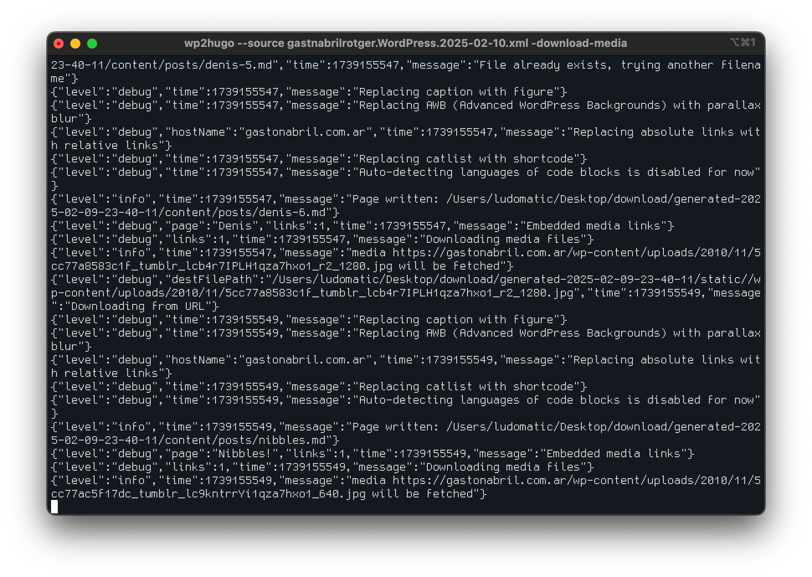
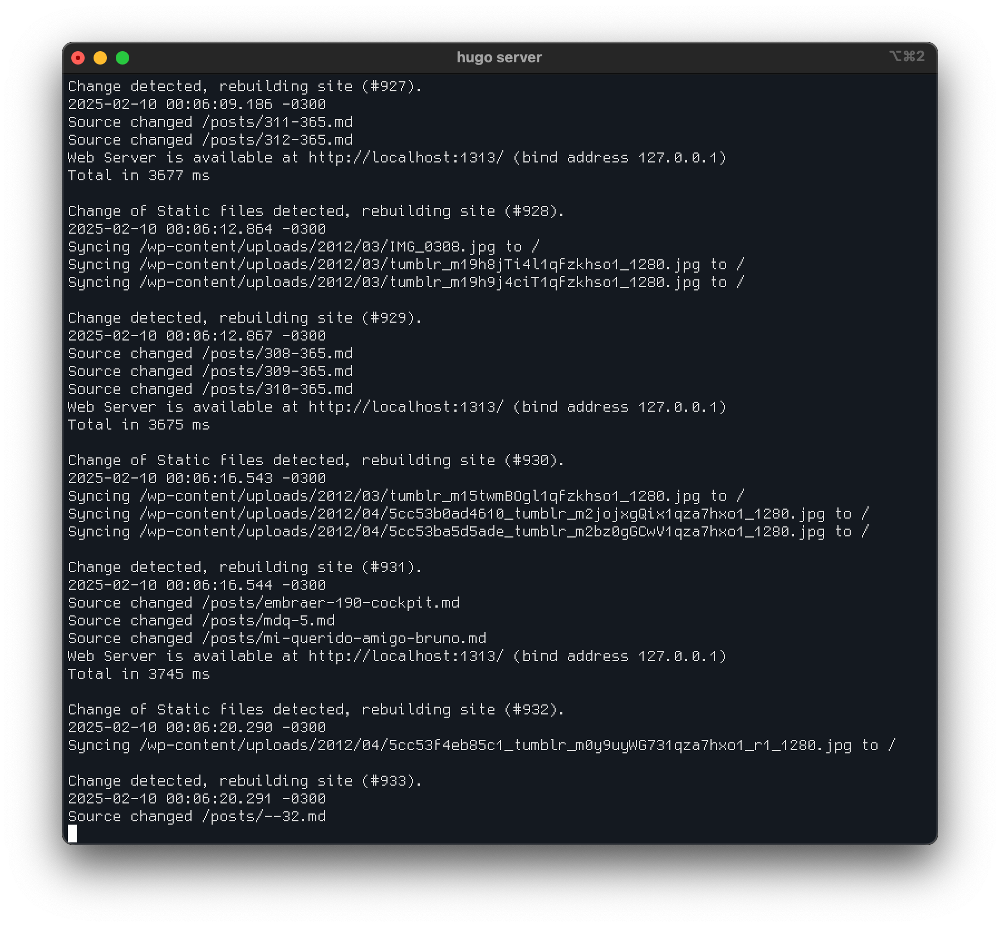
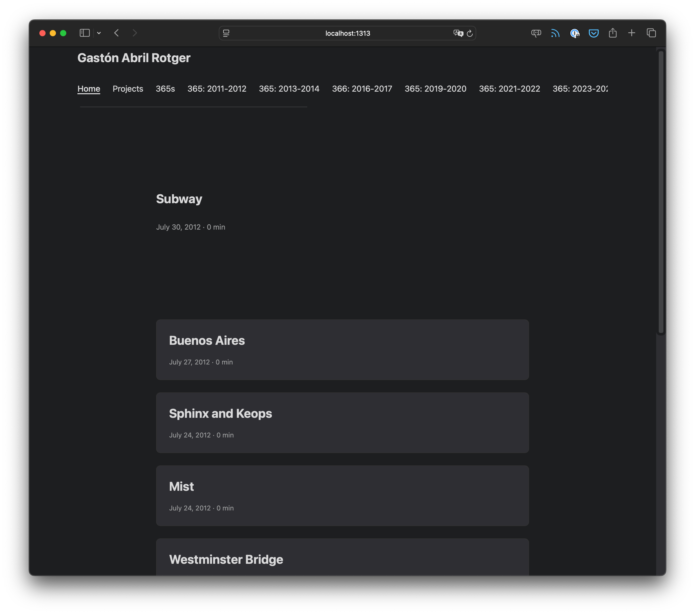

### ¿Por qué?

Hace mucho tiempo que tenía ganas de migrar todo mi blog/portfolio fuera de Wordpress. Cuando empecé a escribir acá (un repo en GitHub que corre sobre Jekyll) me di cuenta que escribir en formato _markdown_ no era tan trágico y que el beneficio de hacerlo era que el blog (después de 16 años) iba a funcionar mejor. Ahora la pregunta era: ¿qué plataforma elijo?

### ¿Cuál SSG debería usar?

La respuesta lógica hubiese sido [Jekyll](https://jekyllrb.com/), considerando que ya vengo usándolo hace tiempo pero el problema es que, al parecer, Jekyll no es muy bueno cuando el blog tiene miles de pagina. El blog/portfolio tiene casi 3000 posts. Miré bastante la documentación de [11ty](https://www.11ty.dev/), [Astro](https://astro.build/) y [Kirby](https://getkirby.com/) y después de investigar, todos los caminos llevaron a [Hugo](https://gohugo.io/). El hecho de que esté desarrollado en [Go](https://go.dev/) hace que el _deploy_ sea muy rapido y lo bueno es que, tanto para configurarlo como para luego modificar el theme a mi gusto, no es necesario saber programar en dicho lenguaje.

### ¿Cómo migrar el contenido?

La cuestión ahora es migrarar los posts a formato .md y conservar el formato de URL para que los links ya existentes no se rompan.

En la documentación de Hugo recomiendan 4 metodologías

1. [wordpress-to-hugo-exporter](https://github.com/SchumacherFM/wordpress-to-hugo-exporter)
2. [blog2md](https://github.com/palaniraja/blog2md)
3. [wordhugopress](https://github.com/nantipov/wordhugopress)
4. [wp2hugo](https://github.com/ashishb/wp2hugo)

Intenté con el modo 1 y 4. **Wordpress to Hugo Exporter** me creó varias carpetas temporales en el servidor/hosting pero jamás terminó de exportar todos los posts. Me consumió un montón de recursos pero estoy seguro que si el blog tuviese menos contenido, la exportación se hubiese hecho sin problema. Quizás no era el método indicado para mi migración pero si el blog de ustedes es más chicos, probablemente les sirva.

**wp2hugo** terminó siendo la opción que funcionó sin problema. Un poco más largo el proceso y "dificil", pero no imposible. Los pasos son [fáciles](https://github.com/ashishb/wp2hugo?tab=readme-ov-file#usage). Cuestión de leer y nada más. Funciona via [MacPort](https://ports.macports.org/port/wp2hugo/details/). Una vez que lo instalas, empieza a scrapear (usando el archivo .xml de wordpres como base) toda la data de cada uno de los posts (incluyendo las fotos) y los guarda de manera local en formato markdown. Un gol absoluto. Si no le pasan el flag `-continue-on-media-download-error`, el script se detiene cuando no encuentra alguna imagen y te dice cual es y a que post pertenece. En mi caso, me sirvio para poder arreglar algunos de los posts que se rompieron de la migración de Tumblr a Wordpress.

Una vez que arregles/editas el posts, descargas el archivo `.xml` nuevamente, e inicias el script otra vez. Lo bueno es que no arranca desde cero sino que sigue desde el último post descargado, eso sí, generará una carpeta por cada intento de scrapeo. Mi recomendación también es usar el flag `-output` y agregar algún path tipo **~/Desktop/temp** para tener más a mano toda la descarga.

Una vez que hayamos iniciado el script, se verá así.



Lo bueno es que el mismos script crea la carpeta con la estructura que usa Hugo para funcionar, por ende, si ejecutamos

```batch
hugo server
```

dentro de la carpeta donde se realiza la descarga/scrapeo, podemos ver como el blog se va generando/migrando.





### Periplos

La particularidad de Hugo es que, a diferencia de Jekyll, el nombre del archivo .md no tiene que contener la fecha. Jekyll utiliza un _naming_ del estilo `YYYY-MM-DD-nombre-del-post.md` para determinar la fecha del post (más allá de que también se aclara en el front matter) mientras que Hugo, esa información la obtiene del _[front matter](https://gohugo.io/content-management/front-matter/)_ directamente. **Wp2hugo** utiliza esa lógica, por ende, todos los posts son importados dentro de la carpeta `/content/posts` sin una estructura de carpetas, porque "no la necesitar" formato, tampoco necesita estructura de carpetas. En lo particular, al tener casi 3000 posts, y venís de Wordpress (y también por como organizo mis fotos en Lightroom) encuentro esta metodología un tanto desordenada. Prefiero tener todo organizado en formato **/AÑO/MES/**, por eso, creé un script en Python que me organiza los posts de dicha manera.

### Python Script

Como comentaba antes, este script lo que hace es iterar por cada uno de los archivos .md, leer el _front matter_ y obtener la fecha del campo `date` y mover el archivo a la carpeta correspondiente.

```python
import os
import shutil
import yaml
from datetime import datetime

# Ruta a tu carpeta content
content_path = "path/to/content"
destination_path = os.path.join(content_path, "blog")

# Crear la estructura AÑO > MES
for root, _, files in os.walk(content_path):
    for file in files:
        if file.endswith(".md"):
            file_path = os.path.join(root, file)
            try:
                # Leer el contenido del archivo
                with open(file_path, "r", encoding="utf-8") as f:
                    lines = f.readlines()

                # Procesar el front matter
                if lines[0].strip() == "---":
                    end_index = lines[1:].index("---\n") + 1
                    front_matter = yaml.safe_load("".join(lines[1:end_index]))
                    date = front_matter.get("date")

                    if date:
                        # Convertir la fecha a un objeto datetime
                        date_obj = datetime.fromisoformat(date)
                        year = date_obj.strftime("%Y")
                        month = date_obj.strftime("%m")

                        # Crear carpetas destino
                        year_folder = os.path.join(destination_path, year)
                        month_folder = os.path.join(year_folder, month)
                        os.makedirs(month_folder, exist_ok=True)

                        # Mover el archivo
                        shutil.move(file_path, os.path.join(month_folder, file))
                        print(f"Moved {file} to {year}/{month}/")
            except Exception as e:
                print(f"Error processing {file}: {e}")
```
