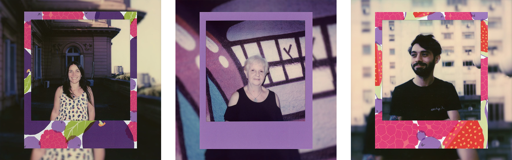

### Otra vez sopa

Al parecer, Python vino a ayudarme con todas las cosas que hacía manualmente. Entre tantas, crear una foto nueva tomando como base una polaroid, es una de ellas. Quizás notaron que la [cuenta oficial](https://instagram.com/polaroid) de Polaroid en Instagram tiene muchísimas publicaciones el mismo concepto:  

+ Formato 1:1 ó 4:5
+ Polaroid centrada
+ Background con el mismo contenido de la polaroid sin el frame

Es un formato bastante sencillo pero lindo. Hace algunos años lo vi en una publicación en Reddit (†) y desde ese entonces lo uso en mis posteos.

Como siempre, el proceso de armar cada foto lo hacía de manera manual con Photoshop. Durante el 2019, realicé un [proyecto fotográfico](https://gastonabril.com.ar/category/365-polaroids/) que consistió en tomar una polaroid por día durante un año. Todo el proyecto lo publiqué en mi web pero jamás vio la luz en Instagram. Y si bien, hay alguna que otra foto publicada, la idea era subirlo completo a IG...pero luego pensé:

> Ni en pedo hago manualmente todo ese proceso del averno. <i class="fa-solid fa-poo"></i>

Con eso en mente, se me ocurrió hacer un script en Python <i class="fa-brands fa-python"></i> que automatice todo el trabajo.

[Pillow](https://github.com/python-pillow/Pillow) parece ser un módulo para manejo de imagen bastante popular dentro de la comunida *pythonera*. Debe ser porque es fácil de entender y está muy bien documentado. Tratar de hacer algo y no conseguirlo se soluciona bastante rápido googleando. ¯\\\_(ツ)_/¯

### Tecnicismos

Según la [página de soporte de Polaroid](https://support.polaroid.com/hc/en-us/articles/115012363647-What-are-Polaroid-photo-dimensions-), el tamaño (incluyendo el marco) de una Polaroid es de 10,752 x 8,847 cm. La *tradución* a pixels sería de 251x305 px. Por eso, el formato que termino usando para la foto es de 741x900 px. El motivo es matener la proporcion en el *aspect ratio* de la foto. Instagram sigue teniendo como limitante un *width* de 1080px. Para poder armar toda la imagen y que quede proporcionada, era fundamental saber las tamaño original de la polaroid. El script lo terminé escribiendo basándome en una imagen de 1765x2145 px. Este tamaño es el ideal, tanto para crear el background como para *resizear* la polaroid y montarla en el medio de la imagen.

El resuelto final será una <i class="fa-regular fa-file-image"></i> imagen de 1080x1080 ó 1080x1350 pixels.



### Uso

El [repo en GitHub](https://github.com/lud0matic/polaroid-to-instagram) tiene un README.md al cual le puse mucho amor pero está en ingles Una explicación en español no viene mal. Vaya a saber quién termina leyendo esto.

1. Cloná el repo donde más te guste.
``` shell
git clone https://github.com/lud0matic/polaroid-to-instagram.git
cd  polaroid-to-instagram
```
2. Al momento de escribir este script estaba usando [Poetry](https://python-poetry.org). Es un gestor de paquetes (estilo pip) bastante completo. Si lo usas, el archivo `poetry.lock` está incluido.
```shell
poetry install
```
Sino, el famoso y querido `requirements.txt` también está.
```shell
pip install -r requirements.txt
```
3. Luego basta ejectuar el script sobre la imagen.
```shell
python main.py /ruta/de/tu/imagen.jpg
```
4. El resultado final será una imagen con el mismo nombre y extensión. El script le agregará un guión bajo y 6 caracteres random para evitar sobreescribir cualquier image preexistente.
5. Por *default*, la imagen será en formato 4:5 y con el background blureado.
6. Se pueden usar los flags `-sq` y/o `-nb` para que la imagen tenga formato 1:1 y sin fondo blureado.
```shell
python main.py /path/to/your/polaroid/photo.jpg -sq -nb
```
7. -h para ayuda.
```shell
python main.py -h
```

### Updates? Quizás

La idea es agregarle el formato 9:16 para stories (seguramente lo escriba en alguno de estos días) y la opción para Spectra (†). Quizás conseguir alguna [Polaroid Round Frame](https://www.polaroid.com/products/color-600-instant-film-round-frame) para lo mismo. La realidad es que son formato que nunca usé. Lo mismo que la [Go](https://www.polaroid.com/products/go-polaroid-camera). Si bien, el tamaño de la foto es más chica, el aspect ratio es el mismo. Con scannear en buena calidad y exportarla en 1765px. el resultado del script debería ser el mismo.

### Resumen

Que lindo que es Python. <i class="fa-solid fa-face-grin-hearts"></i>

<i class="fa-solid fa-clover"></i>